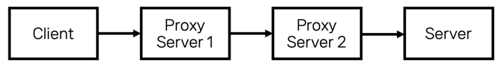

# C4-Preflight-CS 1주차
## #1
웹 성능 최적화를 위해, 페이지를 개선하려고 합니다. 조언을 받은 끝에, 다음과 같은 전략을 취하기로 했습니다.
1. 헤더의 양을 고려하여, 핵심적인 HTML, CSS, JS 파일을 최대한 압축해 48kb 내외로 용량을 조정함.
2. 두번째로 우선순위가 높은 것들은 100kb 이내로 용량을 조정함.

이유를 물어보니, 조언을 해 준 분은 다음과 같은 말만 남깁니다.

> 90kb를 보낼 때랑 100 kb 를 보낼때는 차이가 거의 없어. 근데 100kb를 보낼 때랑 110kb를 보낼 때는 수백ms 가 차이가 나.

- 이유가 무엇일까요?
- 그렇다면, 어떤 이유로 48kb 라는 용량이 나왔을까요?

## #2
ThreadPool 은 스레드를 미리 만들어 놓은 후, Task를 할당하는 방식으로 병렬 처리를 하는 기법입니다.

- 8c 16t CPU가 있다고 가정해 봅시다. ThreadPool의 크기는 어떻게 설정하는게 좋을까? 왜 그럴까요?
- ThreadPool 내 Thread는 어떻게 스케쥴링이 될 수 있을까요? OS의 스케쥴링의 영향을 받나요?
- 16c CPU를 사용하는 상황에서, ThreadPool의 Thread 크기가 300개라고 가정해 봅시다. OS 이론에서 학습한 수많은 스케쥴링 알고리즘 중, 어떤 걸 사용하면 좋을까요?
- 만약, 각각의 Task가 5ms 내외로 종료된다고 해봅시다. 위 선택지가 달라지나요?
- 만약, 각각의 Task가 5ms ~ 20000ms 내외로 종료된다고 해봅시다. 위 선택지가 달라지나요?
- 199개의 스레드는 5ms ~ 20000ms 정도로 실행되는 단일 Task를 갖고 있으나, 1개의 스레드는 5ms ~ 10ms 의 수행시간을 보이는 100개의 Task를 할당 받았다고 해봅시다. 위 선택지가 달라지나요?
- 위 4개의 설명에서 사용되지 않은 스케쥴러가 있나요? 있다면, Task의 크기가 어느 정도의 규모일 때 해당 스케쥴러를 사용하는게 적당하다고 생각하나요?

## #3
새롭게 개발한 서버의 구조는 다음과 같습니다.

모든 서버는 HTTP 를 사용하여 통신을 합니다.

- 서버는 어떻게 클라이언트의 IP를 알아낼 수 있을까요?
- 간헐적으로 503 Service Unavailable 이 발생합니다. (요청 1000번에 1~2번 꼴로) 발생하는 원인이 무엇이고, 이를 어떻게 해결할 수 있을까요?

## #4
다음과 같은 상황에서, 사용할 수 있는 캐시 전략을 작성해 주세요.

- 데이터 하나의 크기가 1kb 인데, 해당 타입의 데이터를 최대 10억번 조회해야 합니다. 캐시는 1GB 입니다. 다만, 특정 1,000,000개의 데이터 조회 빈도가 전체 TPS의 약 95% 정도를 차지합니다. 다만 저희는 그 정보를 미리 알 수 없습니다.
- 위와 유사하나, 서버가 3대입니다.
- 위와 유사하나, 서버가 1대이며 데이터 조회와 수정의 빈도가 1:1 입니다.
- 위와 유사하나, 서버가 3대이며 데이터 조회와 수정의 빈도가 1:1 입니다.

## #5
데이터의 양이 많아짐에 따라, 쿼리의 성능을 개선하기 위해 전반적인 인덱스를 수정하는 작업을 진행하려고 합니다.

- 새롭게 6개의 인덱스가 추가되며, 사용되지 않는 인덱스 4개를 제거할 예정입니다.
- 추가적으로, 특정 필드의 Collation 을 변경해야 합니다.
- 기존 인덱스로도 쿼리는 적당한 성능을 내지만, 해당 인덱스가 존재하지 않으면 매우 높은 확률로 Timeout 이 발생합니다.
- 24시간 트래픽이 들어오며, 평균적으로 150~200 TPS의 요청이 들어옵니다.
- 테이블에는 데이터가 약 1500만개 정도 존재합니다.

서비스 무중단 상태로 인덱스를 전반적으로 수정하는 작업을 진행하려고 합니다. **이슈를 최소화 하여 해당 이슈를 해결하는 방법** 을 설명해 주세요.

## #6
다음과 같은 시나리오를 생각해 봅시다.

- 우리의 서비스에는 `GET /request` 라는 API가 있습니다. 
- 해당 API는 다른 서버의 `GET /request2` 라는 API를 호출하고, 그 결과를 받아 그대로 반환하는 API 입니다.

- 참고를 위해, 두 API의 TPS는 다음과 같다고 가정합시다.
`GET /request` -> 500 TPS
`GET /request2` -> 3000 TPS

1. 성능 차이가 발생하는 이유는 무엇인가요?
2. `GET /request` 요청을 받는 서버의 대수를 10대로 늘렸습니다. `GET /request` 의 TPS가 오를 것이라고 보시나요?
3. `GET /request2` 요청을 받는 서버의 대수를 10대로 늘렸습니다. `GET /request` 의 TPS가 오를 것이라고 보시나요?
4. `GET /request2` 서버가 1대라고 가정할 때, 성능을 가장 극대화 시킬 수 있는 방법을 설명하세요.